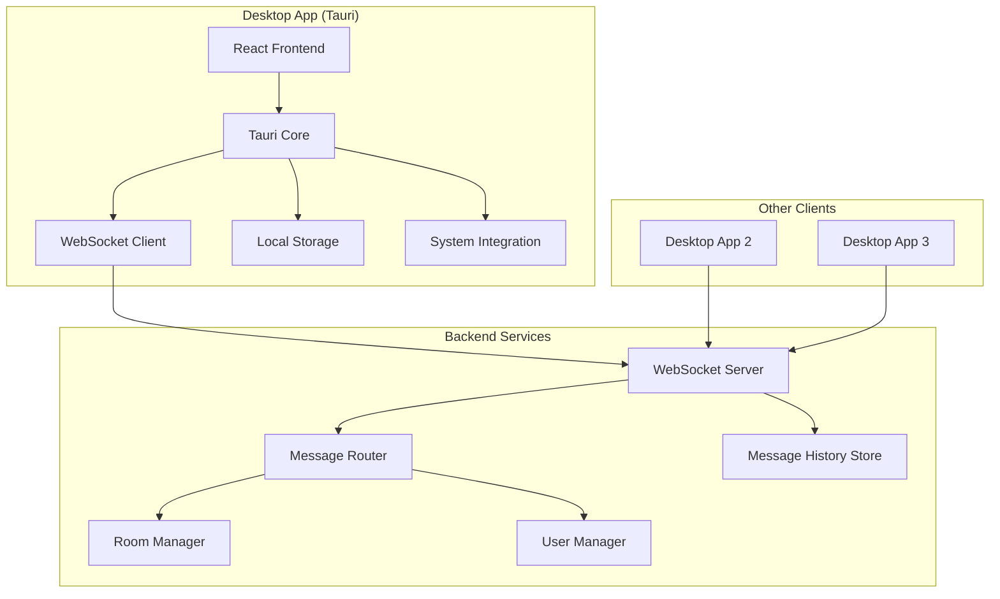

# Design Document

## Overview

The Tauri Chat App will be built as a hybrid desktop application using Tauri's Rust backend with a modern web frontend. The architecture follows a client-server model where multiple Tauri app instances connect to a central WebSocket server for real-time communication. The frontend will be built with React and TypeScript for type safety and component reusability, while the Tauri backend handles system integration and WebSocket communication.

## Architecture

### High-Level Architecture



### Technology Stack

**Frontend:**
- React 18 with TypeScript
- Tailwind CSS for styling
- Zustand for state management
- React Query for server state management

**Tauri Backend:**
- Rust with Tauri framework
- tokio-tungstenite for WebSocket client
- serde for JSON serialization
- tauri-plugin-store for local persistence

**Server (Separate Service):**
- Node.js with TypeScript
- ws library for WebSocket server
- In-memory storage for simplicity (can be extended to Redis/Database)

## Components and Interfaces

### Frontend Components

#### Core Components
1. **App Component**: Root component managing global state and routing
2. **ChatLayout**: Main layout with sidebar and chat area
3. **RoomSidebar**: List of available rooms and user controls
4. **ChatArea**: Message display and input area
5. **MessageList**: Scrollable list of messages with virtual scrolling
6. **MessageInput**: Text input with send functionality
7. **UserSetup**: Initial user name setup modal

#### State Management
```typescript
interface AppState {
  user: {
    id: string;
    displayName: string;
  } | null;
  currentRoom: string | null;
  rooms: Room[];
  messages: Record<string, Message[]>;
  connectionStatus: 'connected' | 'connecting' | 'disconnected';
  typingUsers: Record<string, string[]>;
}

interface Message {
  id: string;
  roomId: string;
  userId: string;
  userName: string;
  content: string;
  timestamp: number;
  status: 'sending' | 'sent' | 'failed';
}

interface Room {
  id: string;
  name: string;
  userCount: number;
  lastActivity: number;
}
```

### Tauri Backend Interface

#### Commands (Frontend → Backend)
```rust
#[tauri::command]
async fn connect_websocket(server_url: String) -> Result<(), String>

#[tauri::command]
async fn send_message(room_id: String, content: String) -> Result<(), String>

#[tauri::command]
async fn join_room(room_id: String) -> Result<(), String>

#[tauri::command]
async fn leave_room(room_id: String) -> Result<(), String>

#[tauri::command]
async fn set_user_name(name: String) -> Result<(), String>

#[tauri::command]
async fn get_stored_user() -> Result<Option<User>, String>
```

#### Events (Backend → Frontend)
```typescript
// Event types that the frontend listens for
type TauriEvents = {
  'message-received': Message;
  'room-joined': { roomId: string; users: User[] };
  'room-left': { roomId: string };
  'user-joined': { roomId: string; user: User };
  'user-left': { roomId: string; userId: string };
  'typing-start': { roomId: string; userId: string; userName: string };
  'typing-stop': { roomId: string; userId: string };
  'connection-status': 'connected' | 'connecting' | 'disconnected';
}
```

### WebSocket Protocol

#### Message Types
```typescript
type WebSocketMessage = 
  | { type: 'join-room'; roomId: string; userName: string }
  | { type: 'leave-room'; roomId: string }
  | { type: 'send-message'; roomId: string; content: string }
  | { type: 'typing-start'; roomId: string }
  | { type: 'typing-stop'; roomId: string }
  | { type: 'message'; id: string; roomId: string; userId: string; userName: string; content: string; timestamp: number }
  | { type: 'user-joined'; roomId: string; user: User }
  | { type: 'user-left'; roomId: string; userId: string }
  | { type: 'room-history'; roomId: string; messages: Message[] }
  | { type: 'typing-indicator'; roomId: string; userId: string; userName: string; isTyping: boolean };
```

## Data Models

### User Model
```typescript
interface User {
  id: string;
  displayName: string;
  joinedAt: number;
  lastSeen: number;
}
```

### Room Model
```typescript
interface Room {
  id: string;
  name: string;
  createdAt: number;
  users: Set<string>;
  messageHistory: Message[];
}
```

### Message Model
```typescript
interface Message {
  id: string;
  roomId: string;
  userId: string;
  userName: string;
  content: string;
  timestamp: number;
}
```

## Error Handling

### Connection Errors
- **WebSocket Connection Failed**: Show connection status indicator, attempt automatic reconnection with exponential backoff
- **Message Send Failed**: Mark message as failed, provide retry button, queue for retry when connection restored
- **Room Join Failed**: Show error notification, allow user to retry or try different room

### Validation Errors
- **Invalid Display Name**: Show inline validation errors, prevent submission until valid
- **Empty Message**: Disable send button when input is empty
- **Room Name Invalid**: Validate room names client-side before attempting to join

### Recovery Strategies
- **Auto-reconnection**: Implement exponential backoff (1s, 2s, 4s, 8s, max 30s)
- **Message Queuing**: Store failed messages locally and retry when connection restored
- **State Persistence**: Save user preferences and current room to local storage
- **Graceful Degradation**: Show offline mode when server unavailable

## Testing Strategy

### Unit Testing
- **Frontend Components**: Jest + React Testing Library for component behavior
- **State Management**: Test Zustand stores in isolation
- **Tauri Commands**: Mock Tauri APIs and test command logic
- **WebSocket Protocol**: Test message serialization/deserialization

### Integration Testing
- **Frontend-Backend Communication**: Test Tauri command invocation and event handling
- **WebSocket Flow**: Test complete message flow from send to receive
- **Room Management**: Test joining/leaving rooms and user state updates

### End-to-End Testing
- **Multi-Client Scenarios**: Test with multiple app instances
- **Connection Recovery**: Test reconnection scenarios
- **Message Delivery**: Verify messages reach all intended recipients
- **Performance**: Test with high message volume and multiple rooms

### Manual Testing Scenarios
- **Cross-Platform**: Test on Windows, macOS, and Linux
- **Network Conditions**: Test with poor/intermittent connectivity
- **Long-Running Sessions**: Test memory usage and performance over time
- **Edge Cases**: Test with special characters, long messages, rapid typing